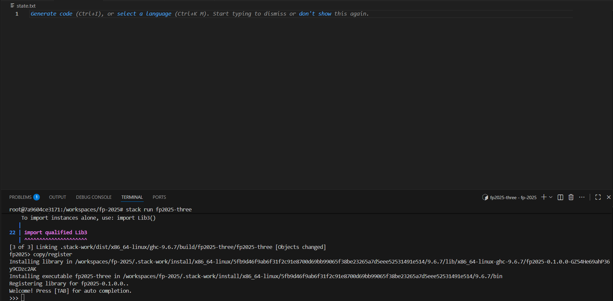
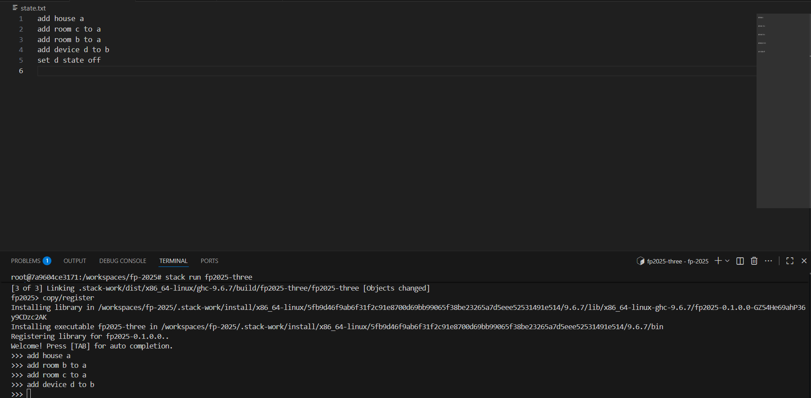
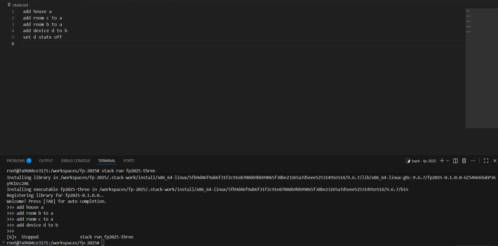
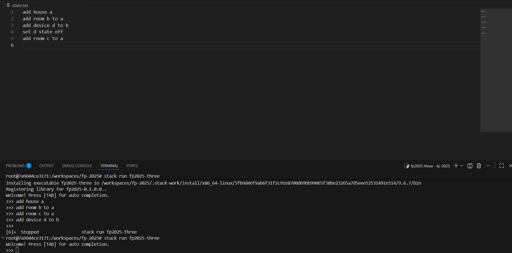
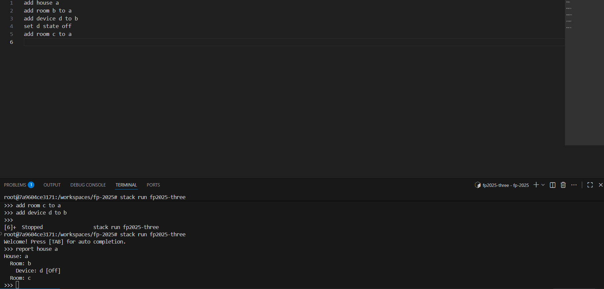

# fp-2025

## Setup

### To get started, you first need to open the project using Visual Studio Code and having Docker Desktop
1. `Ctrl + Shift + P`
2. `Dev Containers: Open Folder in Container`

### To Build & Test the Project, run the following commands
1. `stack build`
2. `stack test`

## Chosen domain
### Smart Home
1. Main entities:
    - House
    - Room
    - Device
    - Rule
    - Status
2. Operations:
    - `add house <name>` – Create a new house.  
    - `add room <name> to <house>` – Create a room inside a house.  
    - `add device <name> to <room>` – Add a device to a room (recursive if adding to a smart hub).  
    - `remove house/room/device <name>` – Remove an entity and its sub-elements.  
    - `rename house/room/device <oldName> to <newName>` – Rename an entity.  
    - `set device <name> state <value>` – Change the state of a device.  

    - `turn on <device>` / `turn off <device>` – Control device power.  
    - `set <device> brightness <value>` – Adjust brightness of a device.  
    - `set <device> temperature <value>` – Adjust temperature of a device.  
    - `schedule <device> <action> at <time>` – Create automation for a device.  
    - `simulate day` – Execute scheduled actions for all devices recursively.  
    - `report room <name>` – Show the state of all devices in a room.  
    - `report house <name>` – Recursively report the state of all rooms and devices in a house.  
    - `dump examples` – Output example commands to demonstrate the DSL syntax.
3. Examples
    ``` 
        1. add house MyHome
         Creates a new house called "MyHome".

        2. add room Kitchen to MyHome
           # Adds a room "Kitchen" inside "MyHome".
        
        3. add device Lamp to Kitchen
           # Adds a simple device "Lamp" in the "Kitchen".
        
        4. add device SmartHub to Kitchen
           add device CoffeeMaker to SmartHub
           add device Toaster to SmartHub
           # Demonstrates recursion: "SmartHub" contains sub-devices "CoffeeMaker" and "Toaster".
        
        5. turn on Lamp
           # Turns on a single device.
        
        6. report house MyHome
           # Recursively shows all rooms and devices in "MyHome", including devices inside SmartHub.
        
    ```
## BNF
```
   <command> ::= 
     <add_command> 
   | <remove_command>
   | <set_command> 
   | <rename_command> 
   | <control_command> 
   | <schedule_command> 
   | <report_command> 
   | <simulate_command> 
   | "dump examples"

   <add_command> ::= 
        "add house " <house_name> 
      | "add room " <room_name> " to " <house_name> 
      | "add device " <device_name> " to " <room_or_device_name>

   <remove_command> ::= 
        "remove house " <house_name> 
      | "remove room " <room_name> 
      | "remove device " <device_name>

   <set_command> ::= 
        "set " <device_name> " brightness to " <value> 
      | "set " <device_name> " temperature to " <value> 
      | "set " <device_name> " state to " <state>

   <rename_command> ::= 
        "rename house " <old_name> " to " <new_name> 
      | "rename room " <old_name> " to " <new_name> 
      | "rename device " <old_name> " to " <new_name>

   <control_command> ::= 
        "turn on " <device_name> 
      | "turn off " <device_name>

   <schedule_command> ::= "schedule " <device_name> <action> " at " <value>

   <report_command> ::= <report_house>
                   | <report_room>
                   | <report_device>

   <report_house> ::= "report house " <house_name> <report_list>
   <report_room>  ::= "report room " <room_name> <report_list>
   <report_device> ::= "report device " <device_name>

   <report_list> ::= <report_command> <report_list> | <empty>
   <empty> ::= "."


   <simulate_command> ::= "simulate day"

   <state> ::= "On" | "Off"

   <house_name> ::= <identifier>
   <room_name> ::= <identifier>
   <device_name> ::= <identifier>
   <room_or_device_name> ::= <room_name> | <device_name>
   <old_name> ::= <identifier>
   <new_name> ::= <identifier> 

   <identifier> ::= <letter> (<letter> | <digit>)*
   <letter> ::= [A-Z] | [a-z]
   <digit> ::= [0-9]

   <value> ::= <digit>+ | <digit>+ "." <digit>+
   <action> ::= "turn on" | "turn off" | "set brightness" | "set temperature"

```

## State persistence
When exiting, program serializes the internal `State` into equivalent CLI commands (one per line) and saves them to `state.txt`.  
When restarted, it reads `state.txt`, parses each line back into a `Command`, and executes them, restoring the entire configuration.

### Data Mapping

| State Field | Description | CLI Command Generated |
|--------------|--------------|------------------------|
| `houses :: [House]` | Each house in the state | `add house <houseName>` |
| `rooms :: [Room]` | Rooms inside each house | `add room <roomName> to <houseName>` |
| `devices :: [Device]` | Devices inside rooms | `add device <deviceName> to <roomName>` |
| `deviceStatus :: State` | On/Off state of device | `set <deviceName> state on/off` |
| `deviceBrightness :: Maybe Double` | Optional brightness | `set <deviceName> brightness <value>` |
| `deviceTemperature :: Maybe Double` | Optional temperature | `set <deviceName> temperature <value>` |
| `schedules :: [ScheduleItem]` | Scheduled actions | `schedule <deviceName> <action> <time>` |

Other runtime-only data (like temporary simulation results) is not persisted, as it can be recalculated.

---

### Example 1 — Single House

#### Commands Executed
```bash
add house MyHome
add room Kitchen to MyHome
add device Lamp to Kitchen
turn on Lamp
set Lamp brightness 80
```
#### State
```
State
  { houses =
      [ House "MyHome"
          [ Room "Kitchen"
              [ Device "Lamp" On (Just 80.0) Nothing ]
          ]
      ]
  , schedules = []
  }
```
#### Saved state.txt
```
add house MyHome
add room Kitchen to MyHome
add device Lamp to Kitchen
set Lamp brightness 80.0
set Lamp state On
```

### Example 2 - Multiple Houses with Scheduling
#### Commands Executed
```bash
add house Home1
add room LivingRoom to Home1
add device TV to LivingRoom
set TV state on
set TV brightness 40

add house Home2
add room Bedroom to Home2
add device Heater to Bedroom
set Heater temperature 22.5
schedule Heater set temperature 23.0
```

#### State
```
State
  { houses =
      [ House "Home1"
          [ Room "LivingRoom"
              [ Device "TV" On (Just 40.0) Nothing ]
          ]
      , House "Home2"
          [ Room "Bedroom"
              [ Device "Heater" Off Nothing (Just 22.5) ]
          ]
      ]
  , schedules =
      [ ScheduleItem
          { targetedDevice = "Heater"
          , action = SetTemperatureLevel
          , time = 23.0
          }
      ]
  }
```

#### Saved state.txt
```
add house Home1
add room LivingRoom to Home1
add device TV to LivingRoom
set TV brightness 40.0
set TV state On

add house Home2
add room Bedroom to Home2
add device Heater to Bedroom
set Heater temperature 22.5
set Heater state Off

schedule Heater set temperature 23.0
```

## State persistance demonstration
1. Program was launched

2. Some commands were executed

3. Program was exited

4. Program launched again

5. State was viewed and we see it matches state from step 2
